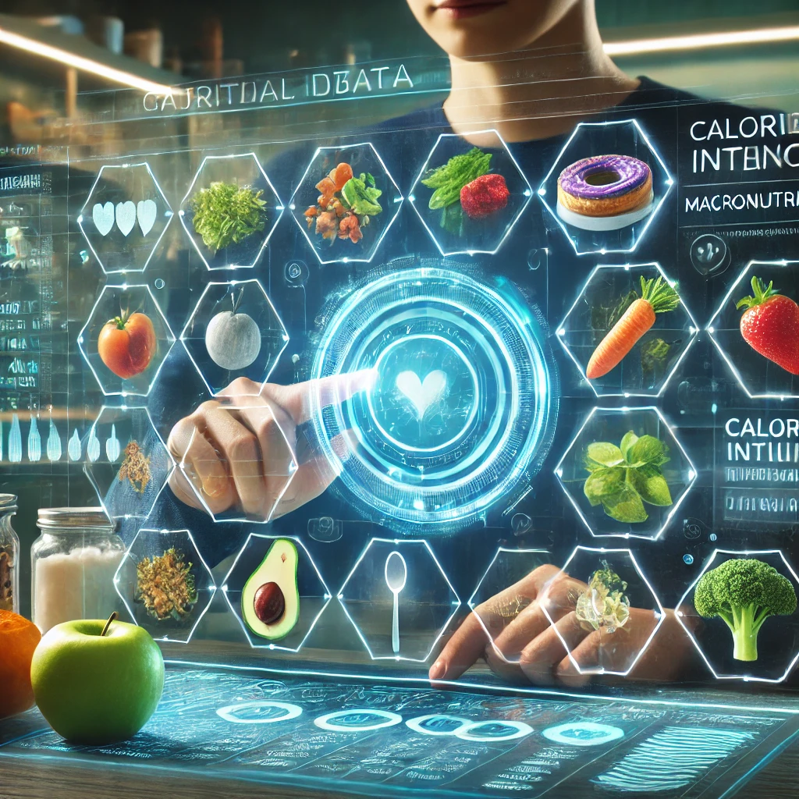
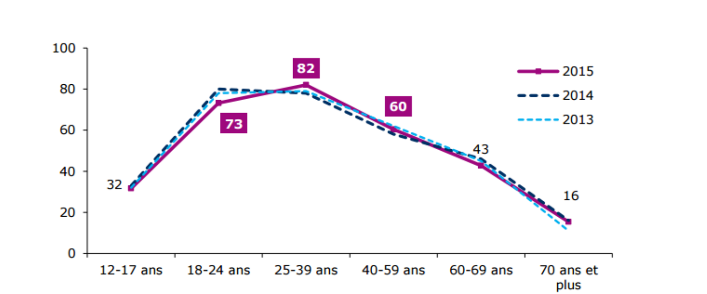

```{r setup, include=FALSE}
knitr::opts_chunk$set(echo = TRUE)
library(knitr)
library(ade4)
library(FactoMineR)
library(ggplot2)
library(dplyr)
```

```{r, echo=FALSE, results='asis'}
if (knitr::is_html_output()) {
  cat('<div style="text-align: center;">\n  \n  <p style="font-style: italic;">Figure 1 : Illustration de l\'alimentation et du digital</p>\n</div>')
} else {
  cat("\\insertcover\n")
}
```

# Introduction

L'alimentation est un sujet au coeurs des questionnements majeurs de notre société. Ce sujet est également de plus en plus lié avec la technologie et la digitalisation de notre environnement. En effet, nous allons voir dans ce rapport le lien entre notre alimentation et le numérique.


# Le numérique au coeur de l'alimentation
## Livraison à dommicile
D'après une étude gouvernemental sur l'alimentation, [] la digistalisation modifie les comportements des consommateurs dans leur processus d'achat d'aliment. Cette digitalisation débute par la recherche d'informations sur les aliments jusqu'à la consommation des produits. Cette évolution numérique marque un changement dans la facon dont les consommateurs font leurs courses mais également la perception de la nouriture par les ménages.

Les changements des habitudes de consommation de cette digitalisation passe nottament par une nomadisation des consommateurs. En effet, de part les applications développées par les distibuteurs, les acheteurs s'informent moins en magasin mais chez eux. On constate donc un temps dédié à l'alimentation réduis. On remarque depuis quelques années un e-commerce en développement qui passe par un achat dématerialisé de ses courses.

L'achat en ligne a fait émerger de nombreux type de e-commerce tel que le click and buy  puis le click and collect qui est de plus en plus populaire.D'après une étude mentionnée dans le journal "Les Echos" [], *33%* des francais apprecient commander des produits alimentaires sur internet. 
Le click and collect facilite les courses des consommateurs et leur évite le temps passé dans le magasin. Cette façon de faire les courses diminue également les achats impulsifs en passant devant les rayons. Cependant, un nombre important de consommateurs refuse de commander en ligne.Il existe trois raisons majeurs à cette rétiscence : *48%* des francais refuse l'achat en ligne au cause de l'impossibilité de voir le produit à l'achat. La deuxième raison est la découverte des produits. En effet, l'achat en ligne prive les consommateurs de découvrir de nouveaux produits. Enfin, *18%* refuse par l'impossibilité de constater les dates de préremption à l'achat. 


```{r logo, echo=FALSE, out.width = '70%', fig.align = "center", fig.cap="Influence de l'age sur les achats en ligne"}

```

On remarque grace au graphique ci-dessous que les achats en lignes sont principalement fait par des personnes entre 18 et 50 ans. Cela s'explique très facilement par le fait que les moins de 18 ans ne sont pas toujours autonome sur les achats en ligne et les + de 60 ans par forcément confiant sur l'utilisation des nouvelles technologies.

Ces applications e-commerce sont un avantage considérable et un gain de temps reconus par leurs utilisateurs. Mise à part les applications pour faciliter ses courses, il exite de nombreuses applications de livraison à dommicile. Ces applications participent à une baisse du temps consacrer à l'alimentation et l'augmentation de la mal-nutrition. D'après une étude de l'INRAE [], *70* à *80%* des personnes agés bénéficiant d'un service de livraison à domicile ne satisfont pas leurs besoins nutritionnels. De plus, entre *40* à *70%* des personnes utilisant la livraison de repas préparés ont un apport en énergie et en protéine insuffisant. 


## Alimentation connectée

Le numérique et la digitalisation de notre alimentation passe également par une meilleure gestion de la consommation. En effet, mise à part un gain de temps grâce à des applications de click and collect ou de livraison à dommicile, le numérique peut également permmettre une meilleurs gestion de la santé ou encore des déchets.

La santé est effectivement un pilier important des normes et règlementations actuelles afin de favoriser une alimentation saine et équilibrée. De nombreux programmes gouvernementaux tel que "manger-bouger" ou encore la taxation sur le sucre des entreprises agroalimentaires valorise cette volonté de gérer la santé des consommateurs. Afin de répondre à cette demande, des applications ont vu le jour tel que ***YUKA***, ***My Fitness Pal***. Ces applications répertorient tous les produits agroalimentaires et détails leurs caractéristiques nutritionelles. Une version payant existe  afin de scanner le code de son produit et d'obtenir des résultats plus détaillé. Cette invention numérique est particulièrement utilisé par les sportifs soucieux de leurs apports en macro et micro-nutriments.
Cependant, ces applications peuvent être utilisée par n'importe qui pour connaitre la qualité de son alimentation et trier les produits bon et moins bon pour notre santé.


De plus, tout comme la santé des consommateur, le gaspillage est un enjeux majeurs de notre sociétés. Les gouvernements travaillent sur le sujet en adoptant nottament la loi **AGEC** en 2020 mais les consommateurs aussi souhaitent limiter leur gaspillage. En effet, en 2015,***Too Good To Go*** une startup danoise c'est développée afin de proposer au consommateur des produits invendus à un prix réduits. Grace à cette application, de nombreux produits destinés à la poubelle et donc au gaspillage peuvent être consommé.


# Perspectives et enjeux


# Conclusion


# Bibliographie


